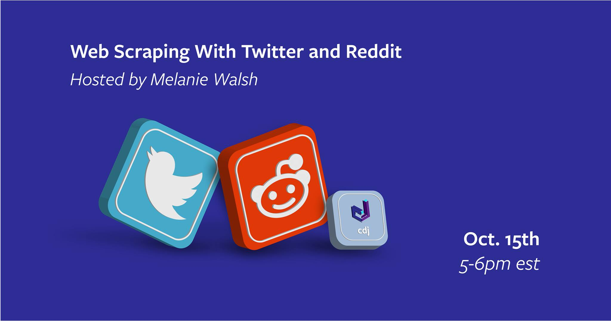

# Web Scraping with Twitter and Reddit
## Cornell Data Journal Workshop

This repository contains materials for a workshop hosted by the [Cornell Data Journal](https://www.facebook.com/cornelldatajournal/) on October 15, 2020.

The main document is a Jupyter notebook that walks you through how to collect Reddit and Twitter data with two basic Python packages, [PSAW](https://github.com/dmarx/psaw) and [twarc](https://github.com/DocNow/twarc). You can open and run this notebook in the cloud by launching [Binder (click here to launch it!)](https://mybinder.org/v2/gh/melaniewalsh/Web-Scraping-Twitter-Reddit-Workshop/main?urlpath=lab/tree/Web-Scraping-Twitter-Reddit-Workshop.ipynb).

These materials draws from extensively from my online textbook, [*Introduction to Cultural Analytics & Python*](https://melaniewalsh.github.io/Intro-Cultural-Analytics/welcome.html).

